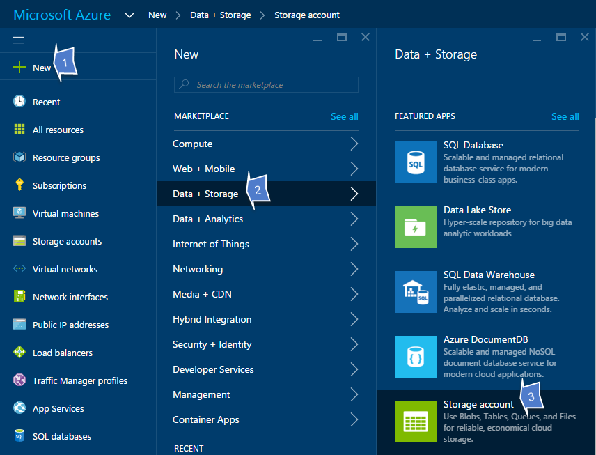
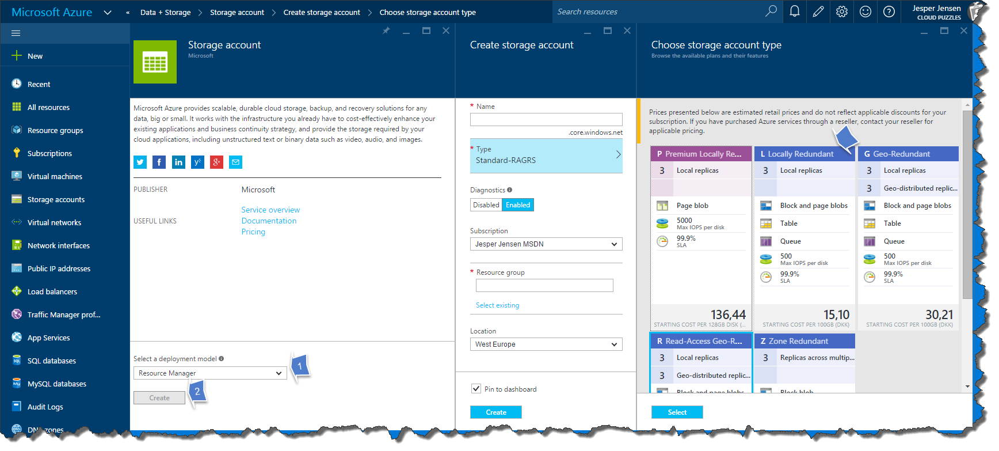
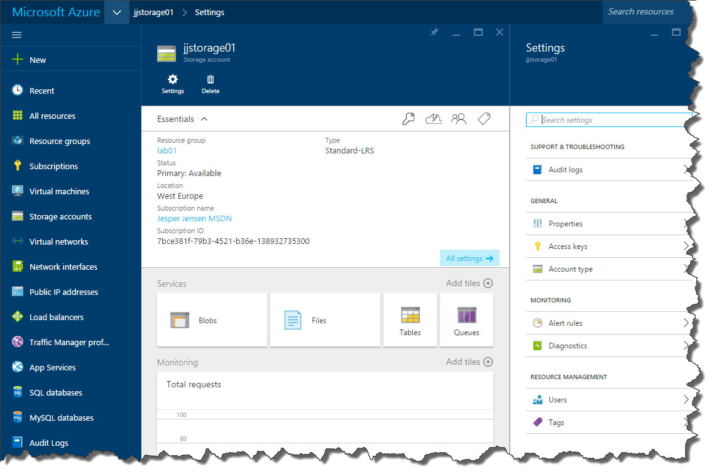

# Create Azure Storage Account

This lab will walk you through creating a Storage Account in Azure. 
First of all, open the [Azure Portal](http://portal.azure.com) or log in through [PowerShell](LINK).

## Using the portal

When using the portal, go to **New** -> **Data + Storage** -> **Storage Account**:


Make sure it says **Resource Manager** in the *Select a deployment model* dropdown box, and click **Create**:


Here we have to fill out some information:

* Name
    * Name of the Storage Account. This has to be a globally unique name, can only be between 3 and 24 characters, and only accepts lowercase letters and numbers
* Type
    * In Azure we can work different types of storage, which will replicate data differently. For this lab a **Locally Redundant** account will do.
* Diagnostics
    * This will collect performance data about your Storage Account. These data will be stored in your Storage Account and uses a small amount of disk space. The choice is up to you :-)
* Subscription
    * If you have multiple subscriptions, make sure you have chosen the correct here. 
* Resource Group
    * Enter a new name for your Resource Group, for example **Storage**.
* Location
    * Select the location you want to deploy your Storage Account to. This has to be the same location as VMs are deployed in later on.
    
Now click **Create** and wait a minute or two, until your account has been created:



## Using PowerShell

If you prefer PowerShell, you will need to create a new Resource Group:

```powershell
New-AzureRmResourceGroup -Name globalazure -Location "West Europe"
```