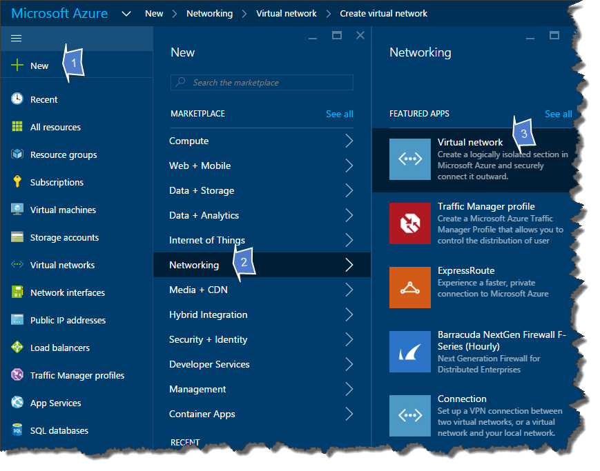
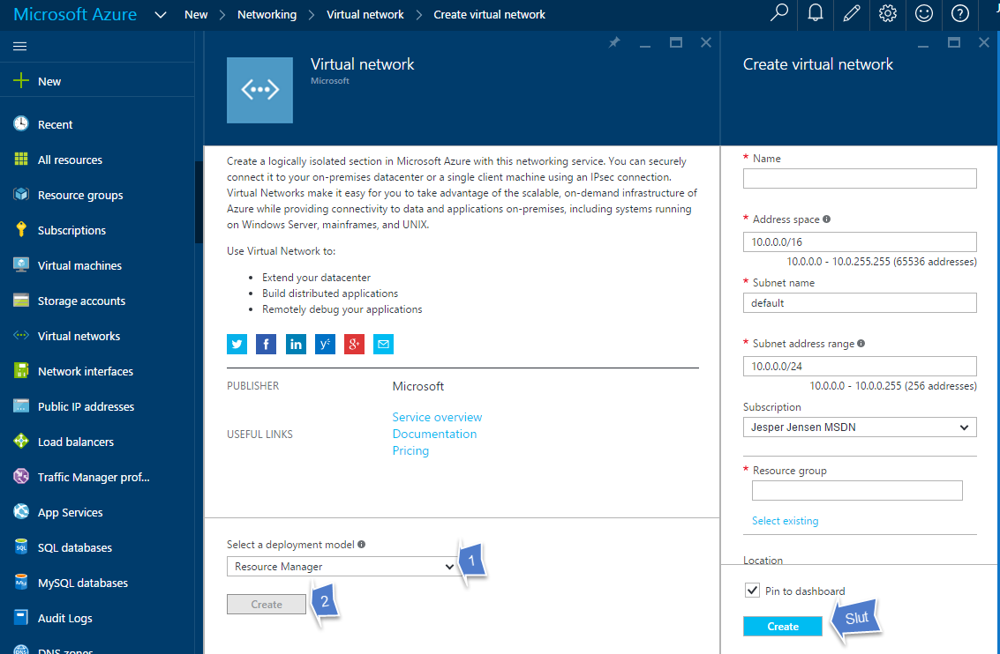
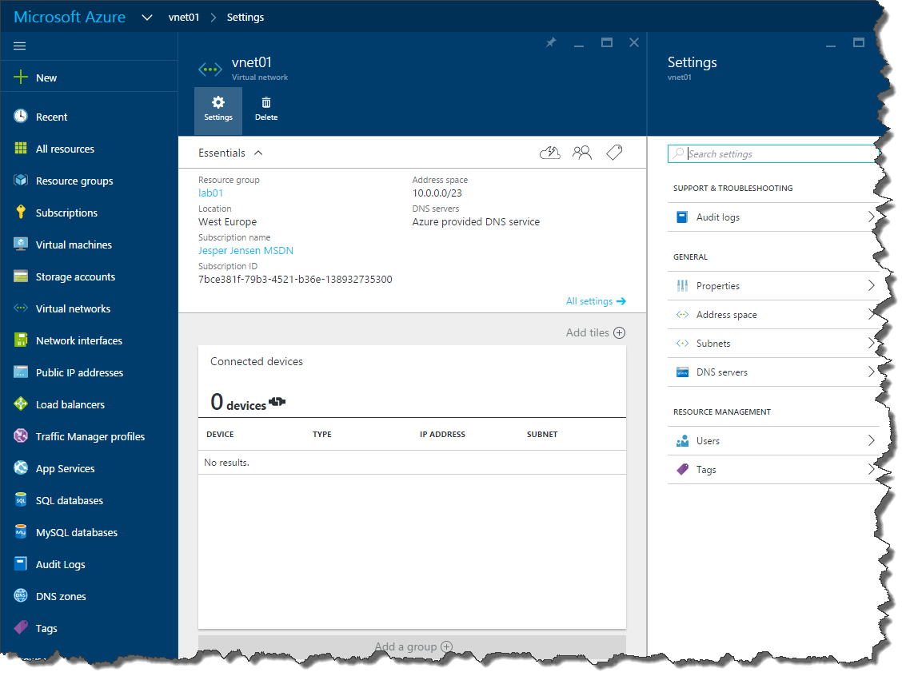

# Create Virtual Network

This lab will go through creation of Virtual Networks in Azure. Just like the [Storage Account lab](../1.CreateStorageAccount/README.md), you can use both the portal and PowerShell.

[Create with portal](#using-the-portal)

[Create with PowerShell](#using-powershell)

## Using the portal

Click **New** -> **Networking** -> **Virtual Network**:



Make sure **Resource Manager** is selected in the dropdown, and click **Create**:


Fill out the fields:

* Name
    * Name of the network, *vnet01* for example
* Address Space
    * Enter an IP address space CIDR - for this lab, use 192.168.0.0/24
* Subnet Name
    * Give your first subnet a name - for this lab, use "Internal"
* Subnet Address Range
    * Enter a subnet CIDR - for this lab, use 192.168.0.0/25 (yes, /25, not /24)
* Subscription
    * If you have multiple subscriptions, select the correct subscription here
* Resource Group
    * Create a new Resource Group, named *Network*
* Location
    * Select the location you want to use - this has to be the same as your VMs will be located in
    
Click **Create** and wait for a minute:


Now we will add a second subnet to the network. SÆDAUHDKB

## Using PowerShell
To create a network with PowerShell, follow these steps:

First, if you haven't already done it, create a new Resource Group:
```powershell
New-AzureRmResourceGroup -Name "globalazure" -Location "West Europe"

ResourceGroupName : globalazure
Location          : westeurope
ProvisioningState : Succeeded
Tags              : 
ResourceId        : /subscriptions/7bce381f-79b3-4521-b36e-138932735300/resourceGroups/globalazure
```

Next we will define our address space and subnets:

```powershell
$addressPrefix = "192.168.0.0/24" 
$backendSubnetPrefix = "192.168.0.0/25" #Internal subnet
$dmzSubnetPrefix = "192.168.0.128/26" #DMZ subnet
$backendSubnetCfg = New-AzureRmVirtualNetworkSubnetConfig -Name "Internal" -AddressPrefix $backendSubnetPrefix
$dmzSubnetCfg = New-AzureRmVirtualNetworkSubnetConfig -Name "DMZ" -AddressPrefix $dmzSubnetPrefix
```

And finally we will create our network, by using the subnet configurations we just created above:
```powershell
New-AzureRmVirtualNetwork -Name "vnet01" -Location "West Europe" -ResourceGroupName "Network" -AddressPrefix $addressPrefix -Subnet $backendSubnetCfg, $dmzSubnetCfg

Name              : vnet01
ResourceGroupName : Network
Location          : westeurope
Id                : /subscriptions/7bce381f-79b3-4521-b36e-138932735300/resourceGroups/Network/providers/Microsoft.Network/virtualNetworks/vnet
                    01
Etag              : W/"89252ba2-b211-4cf4-8503-8c7079d04bbe"
ResourceGuid      : 318213c5-13d8-44ad-87fc-8b14031c5d56
ProvisioningState : Succeeded
Tags              : 
AddressSpace      : {
                      "AddressPrefixes": [
                        "192.168.0.0/24"
                      ]
                    }
DhcpOptions       : {}
Subnets           : [
                      {
                        "Name": "Internal",
                        "Etag": "W/\"89252ba2-b211-4cf4-8503-8c7079d04bbe\"",
                        "Id": "/subscriptions/7bce381f-79b3-4521-b36e-138932735300/resourceGroups/Network/providers/Microsoft.Network/virtualNe
                    tworks/vnet01/subnets/Internal",
                        "AddressPrefix": "192.168.0.0/25",
                        "IpConfigurations": [],
                        "ProvisioningState": "Succeeded"
                      },
                      {
                        "Name": "DMZ",
                        "Etag": "W/\"89252ba2-b211-4cf4-8503-8c7079d04bbe\"",
                        "Id": "/subscriptions/7bce381f-79b3-4521-b36e-138932735300/resourceGroups/Network/providers/Microsoft.Network/virtualNe
                    tworks/vnet01/subnets/DMZ",
                        "AddressPrefix": "192.168.0.128/26",
                        "IpConfigurations": [],
                        "ProvisioningState": "Succeeded"
                      }
                    ]
```